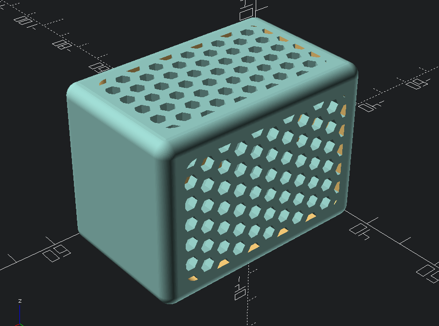
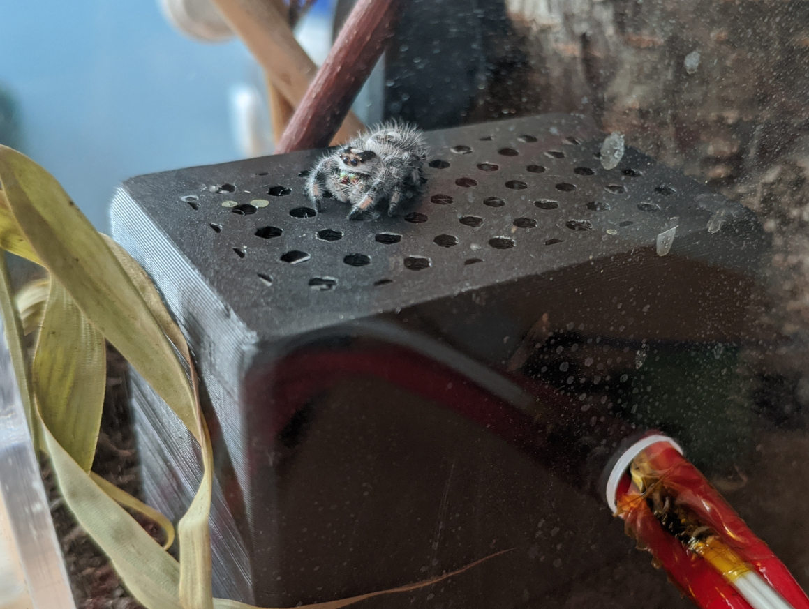
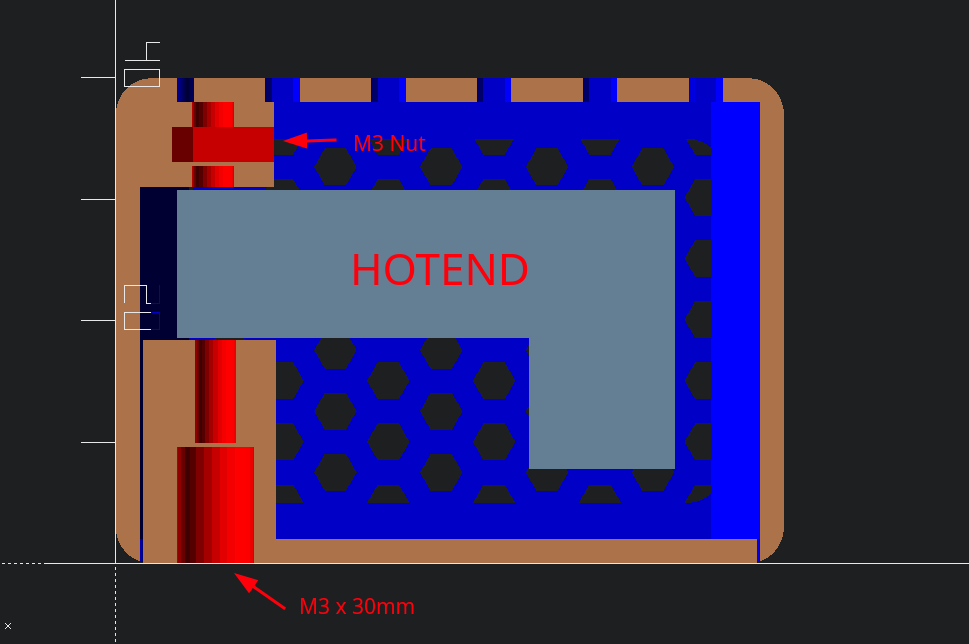

# Terrarium Radiator

An enclosure to turn your 3D printer hotend into a radiator.
This part was designed with [OpenSCAD](https://openscad.org/) and is fully customizable.

<i>Jumping Spider on top of Radiator</i>

## Dependencies

- [Round-Anything](https://github.com/Irev-Dev/Round-Anything)
- [Honeycomb library](https://www.thingiverse.com/thing:2484395)

## Required parts

- Ender 3 Hotend (For other hotends you may need to adjust the customizer variables)
- 2x M3x30mm
- 2x M3 Nut

